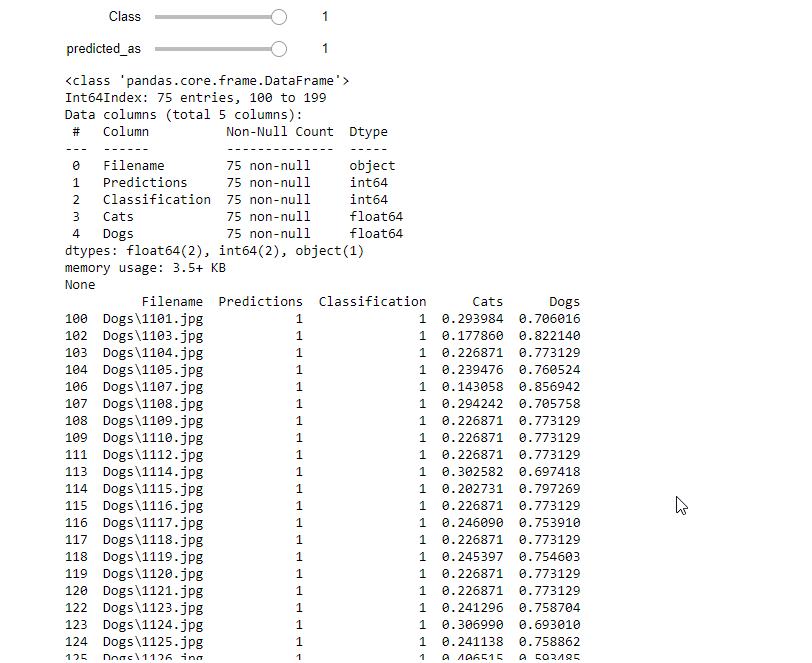
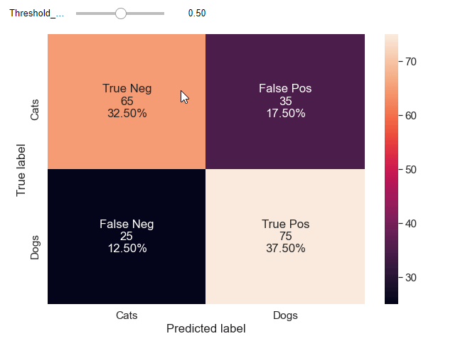
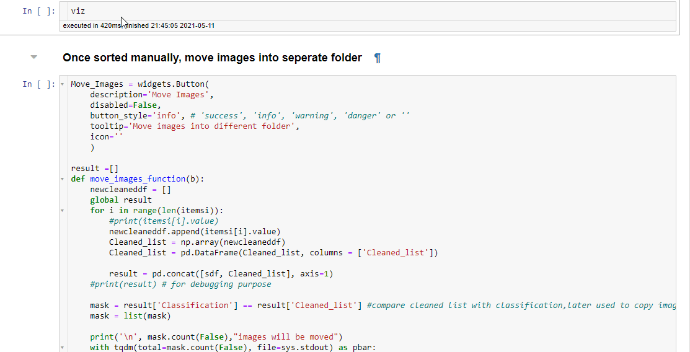
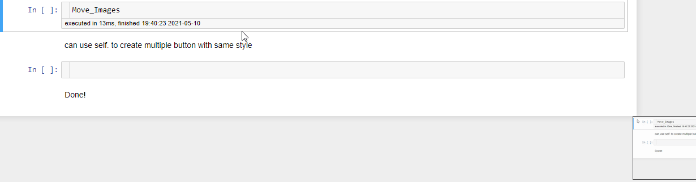

# Interactive confusion matrix
Interactive confusion matrix to visualize predictions and classification and cleaning misclassified

What this tool is?
1) This tool will provide you another step or fine tune your model by INTERACTIVELY visualizing the predicted category and clean missclassified training/testing dataset caused by human error. As they say "GARBAGE IN GARBAGE OUT" right!?

2) Interactively move the classification threshold so one can get acceptable false positive/false negative percentage.
(Just another alternative to precision and Recall plot)

Why this tool is important?

This is important in industry where data is limited and every fraction of percentage increase is crucial.

Prerequisite?
1) Jupyter notebook
2) Ipywidgets (Please check version compatibility with jupyter notebook before installing https://github.com/jupyter-widgets/ipywidgets)

  OR

  For hassle free experience install venv using anaconda "interactive_confusion_matrix.yml" and run the code

For help with conda environment management. Link provided below

https://docs.conda.io/projects/conda/en/latest/user-guide/tasks/manage-environments.html#sharing-an-environment

3) Once model is trained the prediction needs to be saved in csv format. Sample code (sample on training and saving csv for analysis.ipynb) provided to save csv in structured format.

## Funtionalities
### 1) Interactive Slider
Slider to interact with dataframe of predictions

### 2) Interactive Threshold
By default the threshold is set to 50%. changing threshold is one way of optimizing and improving your model performance. But should be considered for fine tuning performance.

### 3) Range Threshold Visualize

### 4) Interactive Confusion Matrix

### 5) Image Cleaner

6) Move Images into assigned folder

Limitaion of this tool?
-The analaysis can only be done on 2 classes for now.

Resources:
https://machinelearningmastery.com/threshold-moving-for-imbalanced-classification/#:~:text=The%20decision%20for%20converting%20a,in%20the%20range%20between%200

Enjoy!
